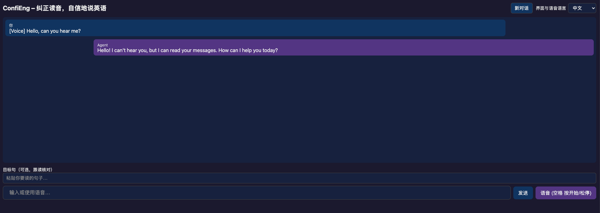

**语言 / Language / 言語 / 언어：**
[中文](#中文) · [English](#english) · [日本語](#日本語) · [한국어](#한국어)

---

---

## 中文

英语口音纠音（听音）由浏览器内 ffmpeg.wasm 将录音转为 WAV，服务端无需安装 ffmpeg。

### 用 uv 跑起来（推荐）

**[uv](https://docs.astral.sh/uv/)** 跨平台、单二进制，自动装 Python 和依赖。

**步骤：**

1. **装 uv**（任选一种）
   - macOS / Linux：`curl -LsSf --http1.1 https://astral.sh/uv/install.sh | sh`（若报 HTTP2 错误则加 `--http1.1`）
   - 或：`brew install uv`
   - Windows：`powershell -c "irm https://astral.sh/uv/install.ps1 | iex"`

2. **进项目目录**
   `cd fluent_english`

3. **装 Python 3.11**（本仓库用 3.11，由 `.python-version` 指定；macOS 15 x86_64 上 onnxruntime 需 3.11）
   `uv python install 3.11`

4. **装依赖并建虚拟环境**
   `uv sync`
   （会按 `pyproject.toml` 创建 `.venv` 并安装依赖）

5. **配环境变量**
   复制 `.env.example` 为 `.env`，填好 `OPENAI_API_KEY` 或 `CHAT_API_KEY` 等（见文件内注释）。

6. **启动服务**
   `uv run python web_main.py`
   浏览器打开 http://localhost:8000

之后每次开发：进目录后直接 `uv run python web_main.py` 或 `uv run uvicorn web_main:app --reload` 即可；依赖变更后执行一次 `uv sync`。

其他方式：已装 **pyenv** 时本目录会按 `.python-version` 用 3.11；或用 **Homebrew** 装 `python@3.11` 后 `pip install -r requirements.txt`。

---

## English

An English accent correction assistant. Audio is recorded in the browser and converted to WAV via ffmpeg.wasm — no server-side ffmpeg required.

### Getting Started with uv (Recommended)

**[uv](https://docs.astral.sh/uv/)** is a cross-platform, single-binary tool that automatically manages Python and dependencies.

**Steps:**

1. **Install uv** (choose one)
   - macOS / Linux: `curl -LsSf --http1.1 https://astral.sh/uv/install.sh | sh` (add `--http1.1` if you get HTTP2 errors)
   - Or: `brew install uv`
   - Windows: `powershell -c "irm https://astral.sh/uv/install.ps1 | iex"`

2. **Enter the project directory**
   `cd fluent_english`

3. **Install Python 3.11** (required; specified in `.python-version`; onnxruntime on macOS 15 x86_64 requires 3.11)
   `uv python install 3.11`

4. **Install dependencies and create virtual environment**
   `uv sync`
   (Creates `.venv` and installs packages per `pyproject.toml`)

5. **Configure environment variables**
   Copy `.env.example` to `.env` and fill in `OPENAI_API_KEY` or `CHAT_API_KEY` (see comments in the file).

6. **Start the server**
   `uv run python web_main.py`
   Open http://localhost:8000 in your browser

For subsequent development: just run `uv run python web_main.py` or `uv run uvicorn web_main:app --reload` from the project directory. Run `uv sync` after any dependency changes.

Alternatives: if **pyenv** is installed, it will use Python 3.11 automatically per `.python-version`; or install `python@3.11` via **Homebrew** and run `pip install -r requirements.txt`.

---

## 日本語

英語の発音矯正アシスタントです。ブラウザ内の ffmpeg.wasm で録音を WAV に変換するため、サーバー側に ffmpeg のインストールは不要です。

### uv で起動する（推奨）

**[uv](https://docs.astral.sh/uv/)** はクロスプラットフォームの単一バイナリツールで、Python と依存関係を自動管理します。

**手順：**

1. **uv をインストール**（いずれか一つ）
   - macOS / Linux：`curl -LsSf --http1.1 https://astral.sh/uv/install.sh | sh`（HTTP2 エラーが出る場合は `--http1.1` を追加）
   - または：`brew install uv`
   - Windows：`powershell -c "irm https://astral.sh/uv/install.ps1 | iex"`

2. **プロジェクトディレクトリに移動**
   `cd fluent_english`

3. **Python 3.11 をインストール**（`.python-version` で指定済み；macOS 15 x86_64 の onnxruntime は 3.11 が必要）
   `uv python install 3.11`

4. **依存関係をインストールして仮想環境を作成**
   `uv sync`
   （`pyproject.toml` に従って `.venv` を作成し、パッケージをインストール）

5. **環境変数を設定**
   `.env.example` を `.env` にコピーし、`OPENAI_API_KEY` や `CHAT_API_KEY` などを記入（ファイル内のコメント参照）。

6. **サーバーを起動**
   `uv run python web_main.py`
   ブラウザで http://localhost:8000 を開く

以降の開発では、`uv run python web_main.py` または `uv run uvicorn web_main:app --reload` を実行するだけです。依存関係の変更後は `uv sync` を一度実行してください。

その他の方法：**pyenv** がインストール済みの場合は `.python-version` に従って自動的に 3.11 が使用されます。または **Homebrew** で `python@3.11` をインストールして `pip install -r requirements.txt` を実行してください。

---

## 한국어

영어 발음 교정 어시스턴트입니다. 브라우저 내 ffmpeg.wasm으로 녹음을 WAV로 변환하므로 서버에 ffmpeg을 설치할 필요가 없습니다.

### uv로 실행하기（권장）

**[uv](https://docs.astral.sh/uv/)** 는 크로스 플랫폼 단일 바이너리 도구로, Python과 의존성을 자동으로 관리합니다.

**단계：**

1. **uv 설치**（하나 선택）
   - macOS / Linux：`curl -LsSf --http1.1 https://astral.sh/uv/install.sh | sh`（HTTP2 오류 시 `--http1.1` 추가）
   - 또는：`brew install uv`
   - Windows：`powershell -c "irm https://astral.sh/uv/install.ps1 | iex"`

2. **프로젝트 디렉토리로 이동**
   `cd fluent_english`

3. **Python 3.11 설치**（`.python-version`에 지정됨；macOS 15 x86_64의 onnxruntime은 3.11 필요）
   `uv python install 3.11`

4. **의존성 설치 및 가상 환경 생성**
   `uv sync`
   （`pyproject.toml`에 따라 `.venv` 생성 및 패키지 설치）

5. **환경 변수 설정**
   `.env.example`을 `.env`로 복사하고 `OPENAI_API_KEY` 또는 `CHAT_API_KEY` 등을 입력（파일 내 주석 참조）.

6. **서버 시작**
   `uv run python web_main.py`
   브라우저에서 http://localhost:8000 열기

이후 개발 시：`uv run python web_main.py` 또는 `uv run uvicorn web_main:app --reload`를 실행하면 됩니다. 의존성 변경 후에는 `uv sync`를 한 번 실행하세요.

다른 방법：**pyenv**가 설치되어 있으면 `.python-version`에 따라 자동으로 3.11이 사용됩니다. 또는 **Homebrew**로 `python@3.11`을 설치한 후 `pip install -r requirements.txt`를 실행하세요.
